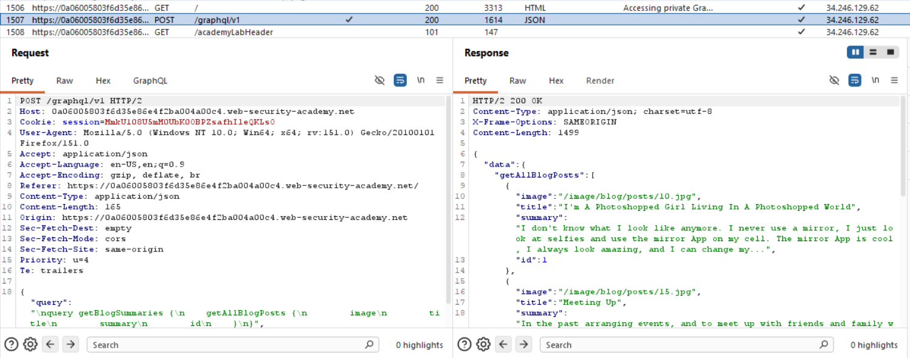
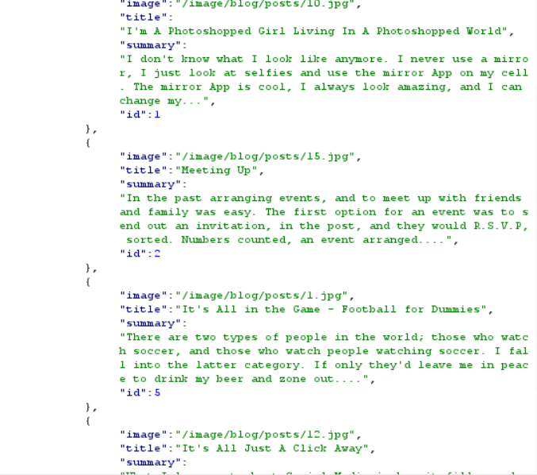
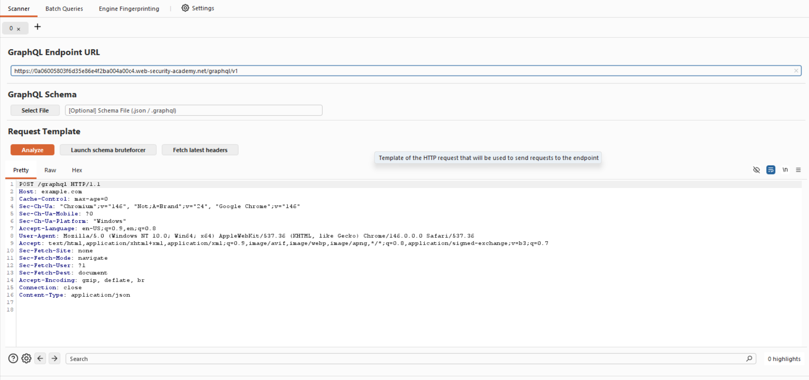
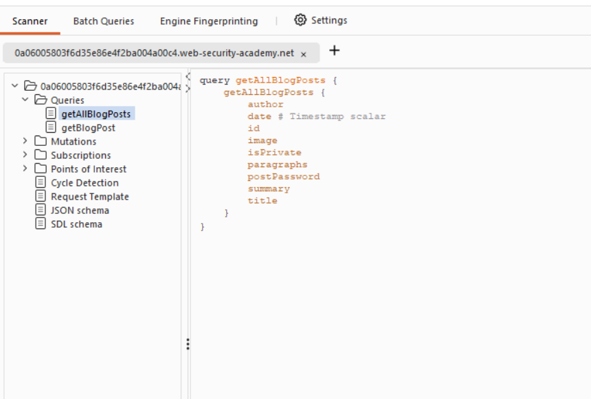
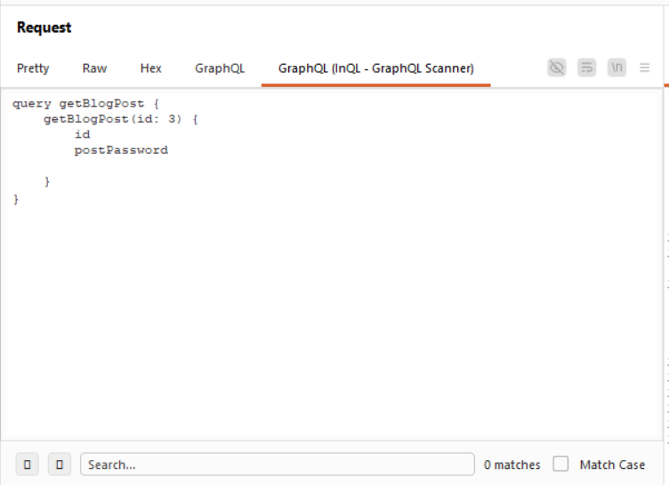
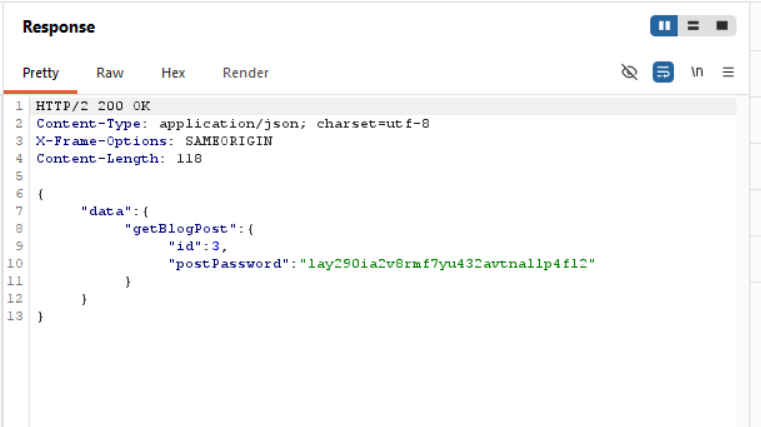

Title: Accessing private GraphQL posts

Objective: find the hidden blog post and enter the password. 

prerequisites: install the InQL scanner from extensions ab in burpsuite.

first to get the GraphQL endpoint we have given that there is a hidden blog post so we click the home and then go to the http hisory tab and we can see the grpahql/v1 endpoint send it to the repeater.

and we can see the reaponse that each blog post has a specific id and id=3 is missing so it is hidden:

now we will paste the url of the post request in the InQL tab at the top :

then click on Analyse then you will see the schema in detail the click on queries:

in this you can see two query types one getAllBlogPost and other one getBlogPost  we will take the query type getBlogPost and pate it in the query in the repeater and delete attributes summary,title,author,paragraphs and everything except id and secret passwd.:

then click send and you will be able to see the secret passwd then submit it to complete the lab:

