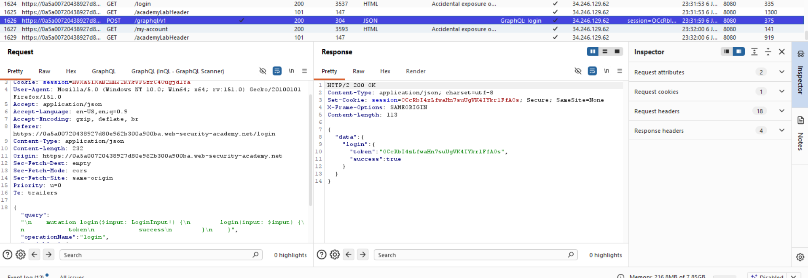
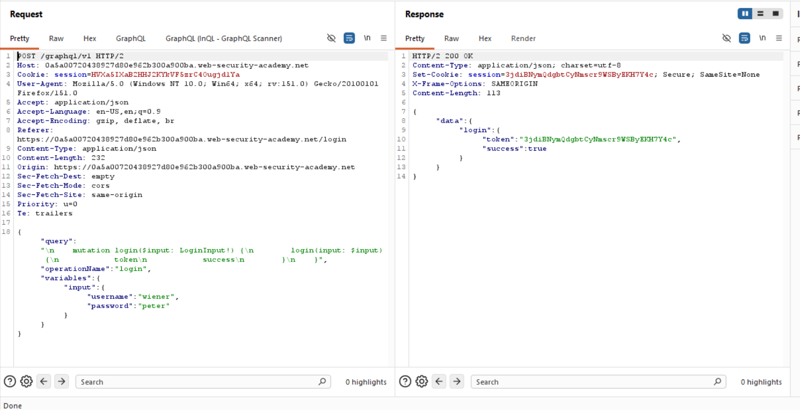
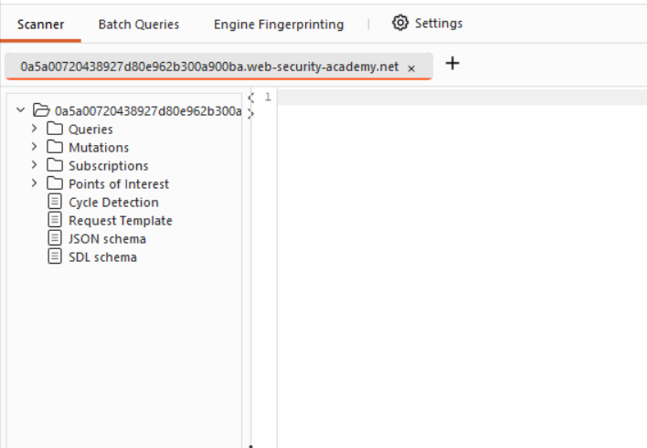
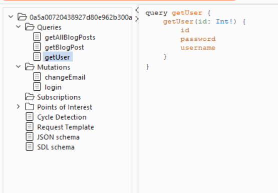
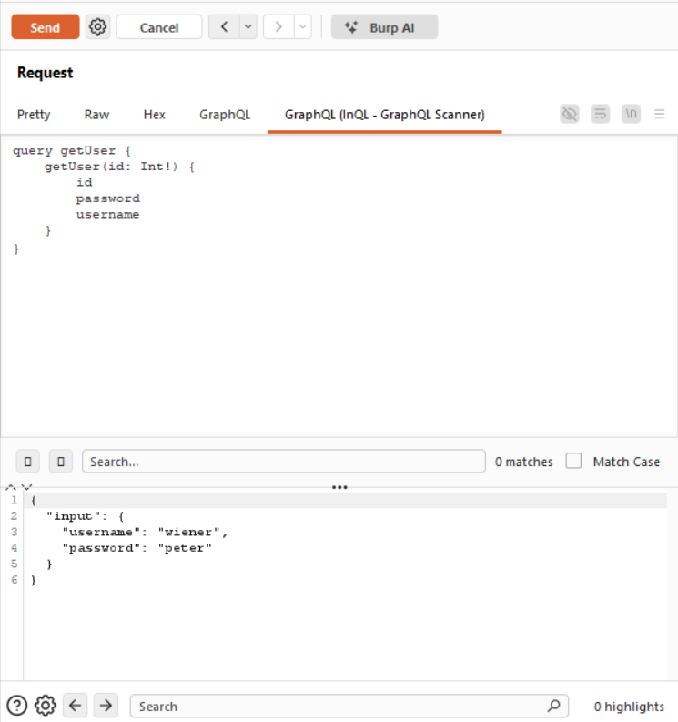
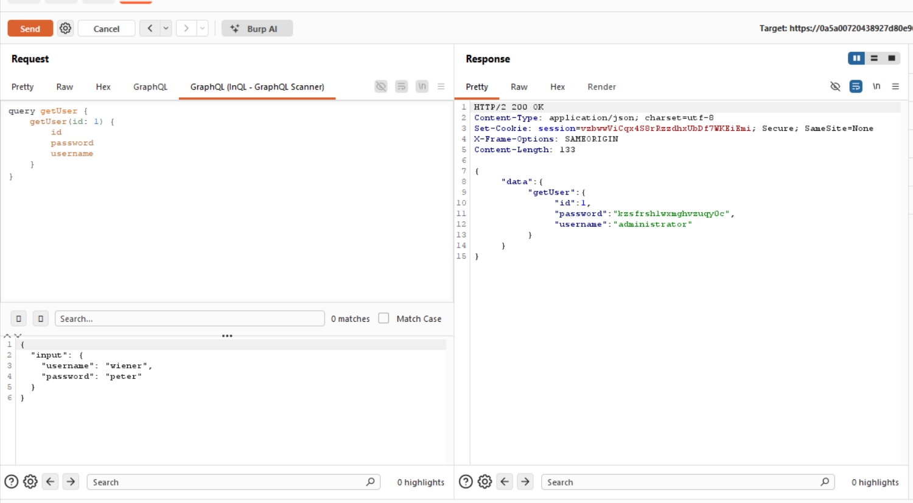
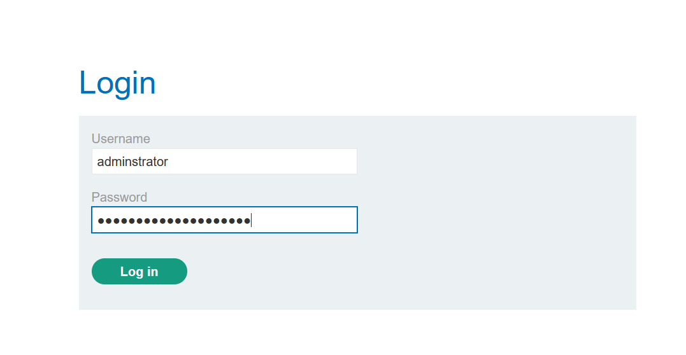
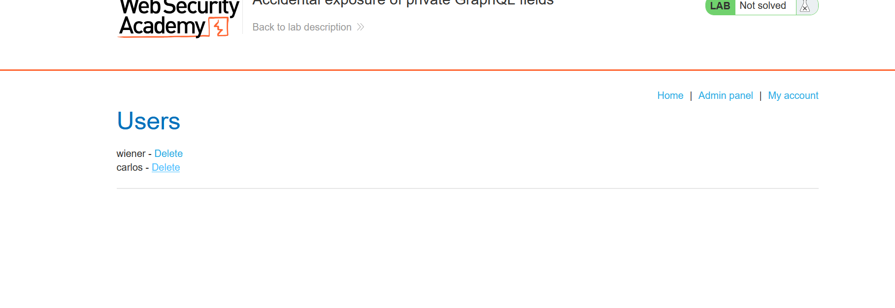
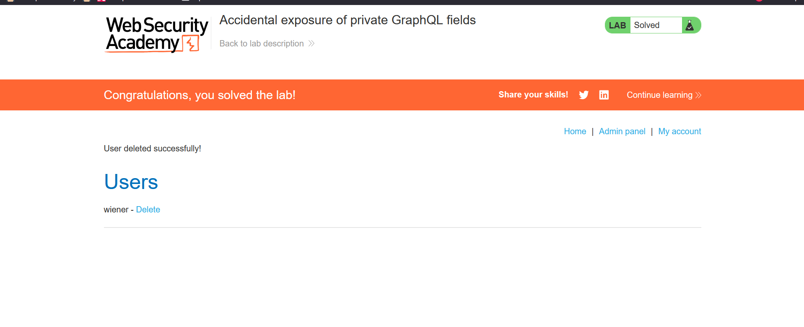

Tiltle: Accidental exposure of private GraphQL fields

objective: sign in as the administrator and delete the username carlos.

first we will find the graphQL endpoint and then send it to the repeater:

as in the objective it is mentioned we have take the admin authorization we login into our account with given credentials then we can see a GqphQL endpoint and send it to the repeater:

now copy the url of the graphql endpoint and paste it in the InQL scanner and analyse it :

here we have the query of get user where we can change the id'sto get to differnet user info:

now lets copy it to the repater's POST request  and try it for different id's:

when we have seen for id=1 we got the administrator:

now we will log out and login as adiminstrator and then delete the user carlos:

like this we have solved the lab :

